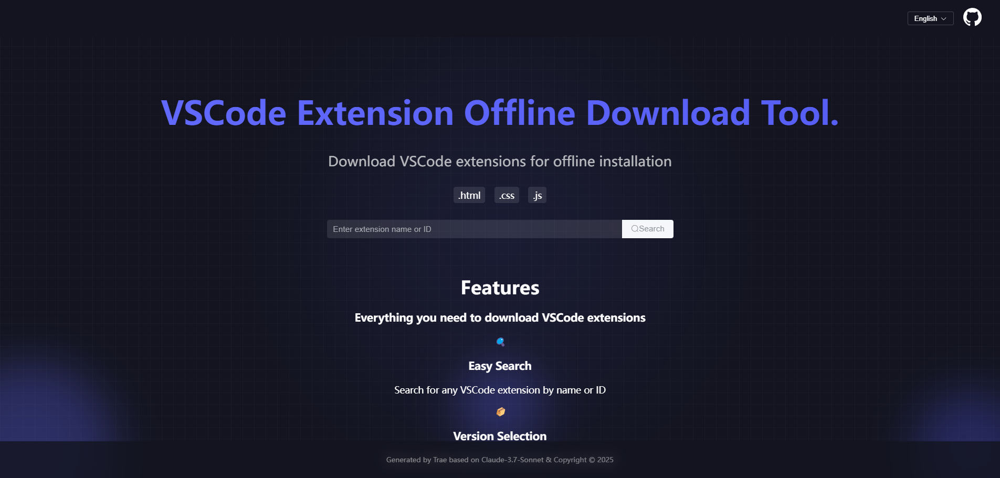

# Download Vsix

[](README.en.md)
[](README.zh.md)
[](README.ja.md)
[](README.ko.md)

## Introduction
Download Vsix is a web application built with Vue 3 and Element Plus, designed to help users download VS Code extensions in .vsix format. This tool provides a user-friendly interface for searching and downloading VS Code extensions.



## Features
- Search VS Code extensions
- Download extensions in .vsix format
- Modern and responsive UI
- Internationalization support (English/Chinese/Japanese/Korean)
- Built with Vue 3 and Element Plus

## Tech Stack
- Vue 3
- Element Plus
- Vue I18n
- Axios
- Vite

## Getting Started

### Prerequisites
- Node.js (v14 or higher)
- npm or yarn

### Installation
1. Clone the repository
```bash
git clone https://github.com/ishangsf/download-vsix.git
cd download-vsix
```

2. Install dependencies
```bash
npm install
# or
yarn install
```

3. Start the development server
```bash
npm run dev
# or
yarn dev
```

4. Build for production
```bash
npm run build
# or
yarn build
```

## Usage
1. Open the application in your browser
2. Search for the VS Code extension you want to download
3. Click the download button to get the .vsix file
4. Install the extension in VS Code using the .vsix file

## Contributing
Contributions are welcome! Please feel free to submit a Pull Request.

## License
This project is licensed under the MIT License - see the LICENSE file for details. 