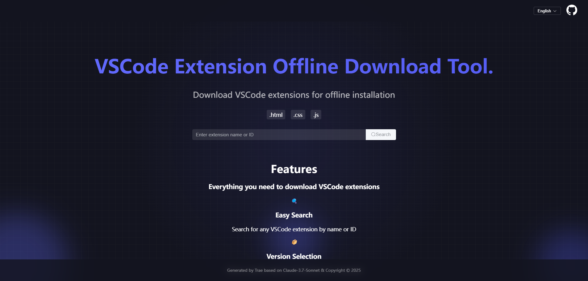

# Download Vsix

[](README.en.md)
[](README.zh.md)
[](README.ja.md)
[](README.ko.md)

## 소개
Download Vsix는 Vue 3와 Element Plus로 구축된 웹 애플리케이션으로, VS Code 확장 프로그램을 .vsix 형식으로 다운로드하는 데 도움을 주는 도구입니다. 사용자 친화적인 인터페이스를 제공하여 VS Code 확장 프로그램을 쉽게 검색하고 다운로드할 수 있습니다.



## 주요 기능
- VS Code 확장 프로그램 검색
- .vsix 형식으로 확장 프로그램 다운로드
- 모던하고 반응형 UI
- 다국어 지원 (영어/중국어/일본어/한국어)
- Vue 3와 Element Plus로 구축

## 기술 스택
- Vue 3
- Element Plus
- Vue I18n
- Axios
- Vite

## 시작하기

### 필수 조건
- Node.js (v14 이상)
- npm 또는 yarn

### 설치 방법
1. 저장소 복제
```bash
git clone https://github.com/ishangsf/download-vsix.git
cd download-vsix
```

2. 의존성 설치
```bash
npm install
# 또는
yarn install
```

3. 개발 서버 실행
```bash
npm run dev
# 또는
yarn dev
```

4. 프로덕션 빌드
```bash
npm run build
# 또는
yarn build
```

## 사용 방법
1. 브라우저에서 애플리케이션 열기
2. 다운로드하고 싶은 VS Code 확장 프로그램 검색
3. 다운로드 버튼을 클릭하여 .vsix 파일 받기
4. VS Code에서 .vsix 파일을 사용하여 확장 프로그램 설치

## 기여
기여를 환영합니다! Pull Request를 자유롭게 제출해 주세요.

## 라이선스
이 프로젝트는 MIT 라이선스 하에 있습니다 - 자세한 내용은 LICENSE 파일을 참조하세요. 